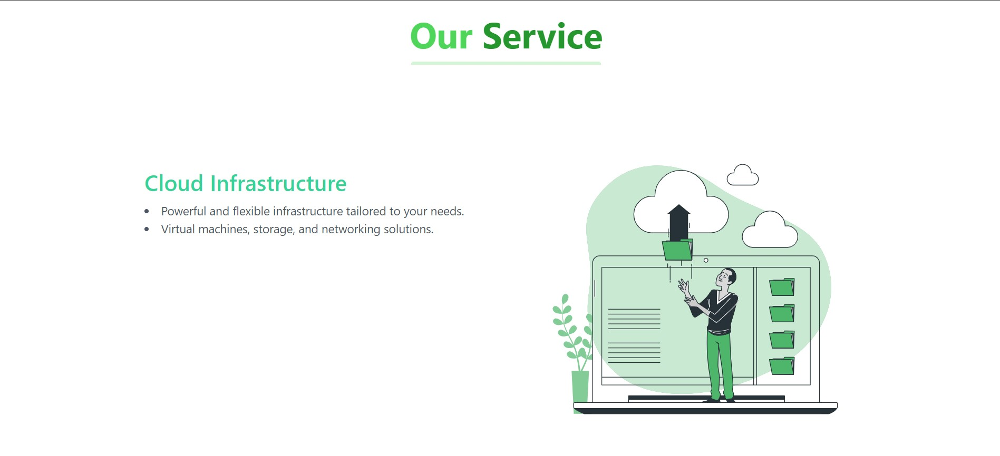

# Aerobyte landing page 


### Description

This is a React.js/ Next.js based landing page plug-n-play template, ideal for startups/companies/service providers wanting to showcase their vision in a single page sleek and modern landing page.

### Features

- Responsive design
- [Next.js](https://nextjs.org) for Static Site Generator

- Integrate with [Tailwind CSS](https://tailwindcss.com)=

- Type checking [TypeScript](https://www.typescriptlang.org)


### Make it your own

#### 1. Clone repo

```
git clone https://github.com/issaafalkattan/react-landing-page-template-2021.git
cd Main
npm install
```

Then, you can run locally in development mode with live reload:

```
npm run dev  
```

Open <http://localhost:3000> with your favorite browser to see your project.

### Sample Images




